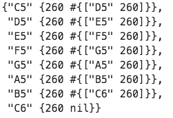

mujic will be a clojure program that uses a Markov chain to generate MIDI music.

First, some notes about the MIDI format.

This is how a MIDI file is structured, as far as I can tell:

    MIDI file
      Sequence
        Track[] *
          Event[]
            Message **
              message as bytes

* Note on track: The first track in a MIDI file is the header, which is metadata
about the song . The other tracks correspond to instruments. For now, I'm only parsing
the first track, which contains just the piano channel, out of my sample song.
One annoying thing is that even though a track is a collection of events, Java
doesn't let me treat it as an array. I have to use .get to get the events in a
track, hence the weirdness of get-track-events.

* Note on Message: In my parser, I cast the Message to a ShortMessage because it
gives me handy functions for pulling out data in a useful format as opposed to
raw bytes.

The full program will consist of three parts:

- Parser

  Parses a MIDI file. Filters out note events and creates a map of those events
  with some more useful information. Here's a sample of the parsed MIDI file for a
  simple musical scale:

  

  Ticks are related to the timing of the command (ticks per quarter note). In a
  standard MIDI file, the timing information in an event represents the *delta* or
  time elapsed since the last event. However, the javax.sound library that I'm using
  uses ticks to represent *cumulative* time since the song's beginning in a MidiEvent.
  Channel is equivalent to the instrument. Channel 0 is acoustic piano.
  Velocity is how hard/fast the note is struck. Velocity 0 is used for note-off events.

- Markov chain

  Takes the parsed MIDI file and makes a nested map that represents the transition matrix
  for the Markov chain. The nested keys are all the notes in the song, followed by the
  different durations of that note in the song. The value is a set of all the note:duration
  tuples that succeed the prefix note:duration in the song. I'm defining "succeeds" as
  the second note starts within 10 ticks of when the first note ends.

  Here's the output transition map for a simple musical scale:

  

- Generator

  Makes a new midi file using the Markov chain.
